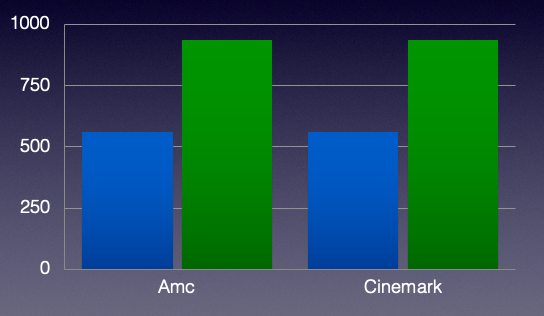
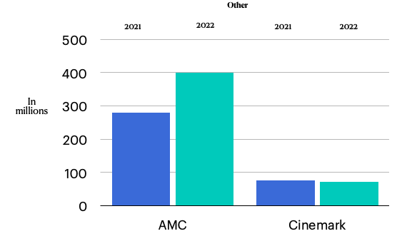

# Amc and Cinemark Revenue

### *Project by Jake Guerrero*

### *This project was originally created in Power BI, but was exported to Microsoft PowerPoint.*
 

### This is a project of how much AMC and Cinemark made from their revenue. Both companies made their revenue through concession stands, ticket sales and other things during 2021 and 2022.

 
 

