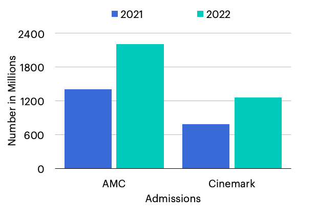

# Amc-v-Cinemark
### *Project by Jake Guerrero*
### *This project was originally created in Power Bi, but was exported to Microsoft PowerPoint*
 

### This is a project of how much AMC and Cinemark made their revenue. Both companies made their revenue through concession stands, ticket sales and other things during 2021 and 2022.

 
 

